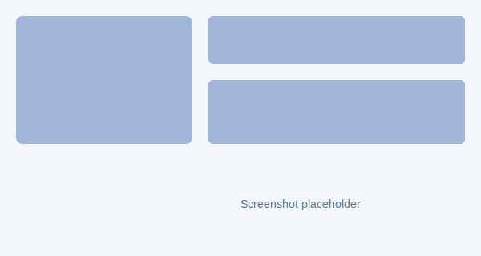

# BIO

Short one-line description of the repository.

[](LICENSE) [](docs/index.html)

Quick look

- What this repo contains (one or two bullets)
- How to get started (single example)
- Where to find more details (link to docs)

Table of contents

- [Quick start](#quick-start)
- [Screenshots](#screenshots)
- [Docs (accessible view)](docs/index.html)
- [Contributing](#contributing)

## Quick start

1. Clone the repo

```bash
git clone https://github.com/ergashruzehaji/BIO.git
```

1. Short setup steps...

## Screenshots

 <!-- add a screenshot at docs/assets/ -->

## Accessibility / Reading help

If the page is hard to read:

- Visit the accessible docs: docs/index.html — larger font, high-contrast colors.
- Use your browser's Reader mode or zoom (Ctrl/Cmd +).

## Contributing

Please open issues or PRs. If you'd like, I can add an accessible docs page or a “large-font” README.
